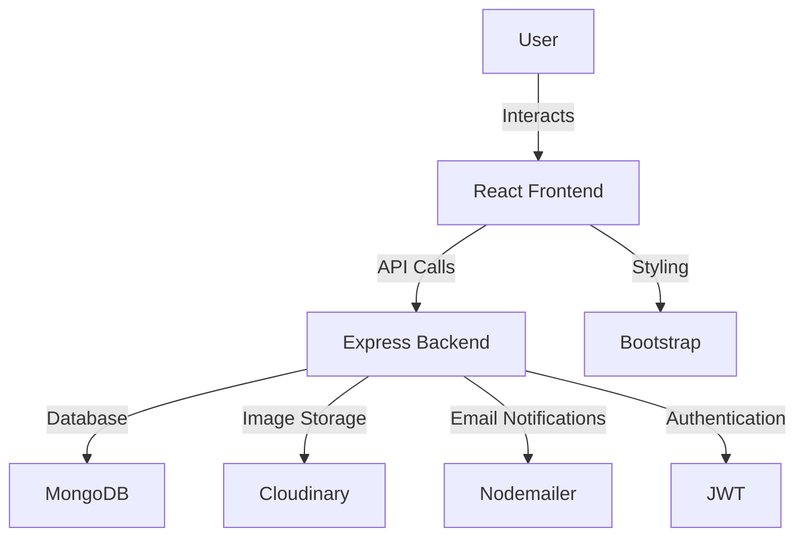

# 🌍 CampuShare
**Campus Goods Sharing System**

CampuShare is a web application designed to foster sustainability and community engagement within campus environments. It enables students and faculty to share goods and services seamlessly. Built with the **MERN stack** (MongoDB, Express, React, Node.js), CampuShare offers an intuitive and visually appealing platform to promote resource sharing and reduce waste.

---

## ✨ Features

- **User Authentication**: Secure account creation, login, and logout using **JSON Web Tokens (JWT)**.
- **Profile Management**: Update personal details and upload profile pictures.
- **Item Creation**: Share items by uploading images, adding descriptions, and specifying pickup locations and times.
- **Item Search**: Easily find available items for sharing within the community.
- **Item Request**: Request to borrow items, with owners receiving notifications to accept or reject.
- **Notification System**: Real-time alerts for item requests and request approvals.
- **Rating System**: Post-transaction ratings to build trust and accountability within the community.

---

## 🧑‍💻 Technologies Used

- **MongoDB**: NoSQL database for storing user, item, and transaction data.
- **Express**: Node.js framework for server-side logic and API endpoints.
- **React**: JavaScript library for building a dynamic user interface.
- **Node.js**: JavaScript runtime for server-side execution.
- **JSON Web Tokens (JWT)**: Secure authentication and data transmission.
- **Cloudinary**: Cloud-based service for managing user and item images.
- **Nodemailer**: Module for sending email notifications.
- **Bootstrap**: CSS framework for responsive and modern UI styling.

---

## 📊 System Architecture

---
